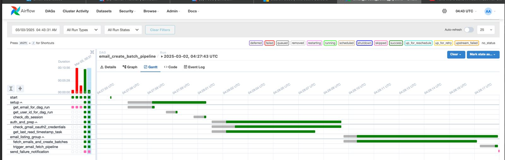
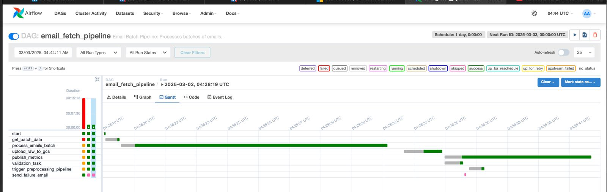
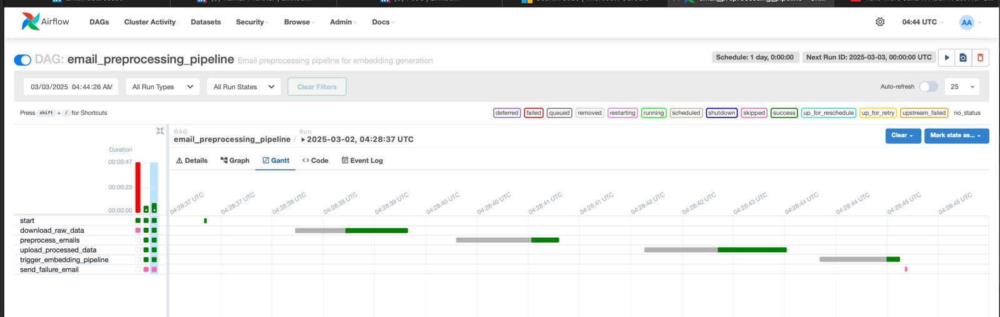
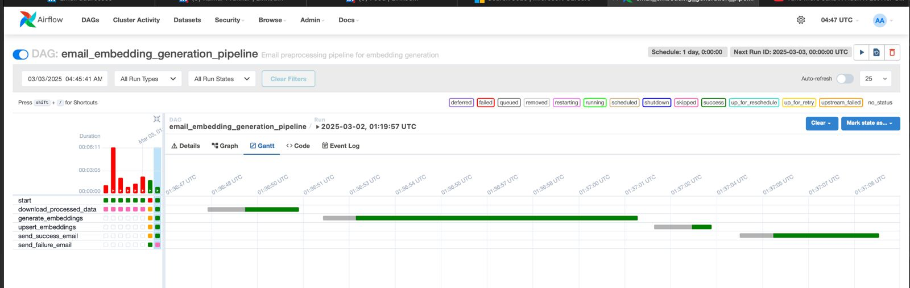
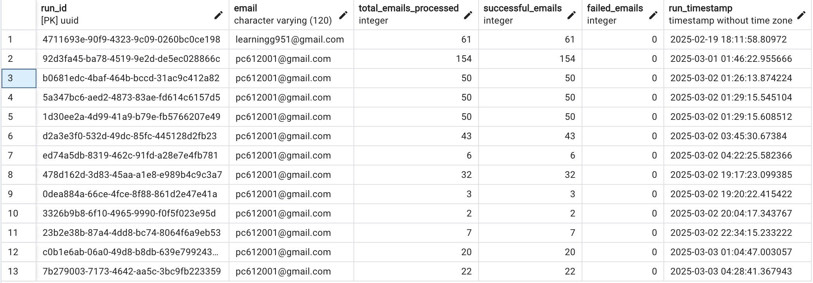

# InboxAI Data Pipeline

## Description

The InboxAI Data Pipeline is a modular, production-grade email processing system built using Apache Airflow and containerized via Docker Compose. It automates the ingestion, transformation, and semantic indexing of Gmail data, enabling efficient downstream querying and analysis. The pipeline is decomposed into orchestrated DAGs covering email batching, raw data fetching, HTML/PII-safe preprocessing, and embedding generation using OpenAI models. It integrates with Google Cloud Storage for data persistence, ChromaDB for vector-based retrieval, and PostgreSQL for metadata logging. Failures and anomalies are captured using robust validation and alerting mechanisms via SMTP. Designed with CI/CD in mind, the system is deployed through a GitHub Actions workflow that validates pipeline health, syncs DAGs, and ensures reproducibility. This pipeline underpins InboxAI's intelligent email assistant, supporting real-time and batch-triggered email processing with high reliability and scalability.

The deployed airflow can be used using the endpoint: http://144.24.127.222:8080/

## 📁 Project Structure

```bash
└── kprakhar27-inboxai/
    ├── data_pipeline/
    │   ├── README.md
    │   ├── docker-compose.yaml
    │   ├── Dockerfile
    │   ├── flow.mermaid
    │   ├── requirements.txt
    │   └── airflow/
    │       ├── README.md
    │       ├── artifacts/
    │       └── dags/
    │           ├── __init__.py
    │           ├── data_delete_pipeline.py
    │           ├── email_00_automate_pipeline.py
    │           ├── email_01_create_batch_pipeline.py
    │           ├── email_02_fetch_pipeline.py
    │           ├── email_03_preprocessing_pipeline.py
    │           ├── email_04_embedding_pipeline.py
    │           ├── models_postgres.py
    │           ├── models_pydantic.py
    │           ├── monitoring.py
    │           ├── update_google_tokens.py
    │           ├── auth/
    │           │   ├── __init__.py
    │           │   └── gmail_auth.py
    │           ├── services/
    │           │   ├── gmail_service.py
    │           │   └── storage_service.py
    │           ├── tasks/
    │           │   ├── __init__.py
    │           │   ├── data_delete_task.py
    │           │   ├── email_batch_tasks.py
    │           │   ├── email_embedding_tasks.py
    │           │   ├── email_fetch_tasks.py
    │           │   └── email_preprocess_tasks.py
    │           ├── tests/
    │           │   ├── __init__.py
    │           │   ├── test_dags.py
    │           │   ├── test_email_00_automate_pipeline.py
    │           │   └── test_email_01_create_batch_pipeline.py
    │           └── utils/
    │               ├── __init__.py
    │               ├── airflow_utils.py
    │               ├── db_utils.py
    │               ├── gcp_logging_utils.py
    │               └── preprocessing_utils.py
    └── .github/
        └── workflows/
            ├── airflow-setup.yml
            └── sync-airflow-dags.yml
```

🧰 Prerequisites

- A Google Cloud Project with billing enabled
- A Google Cloud Storage (GCS) bucket for storing raw and processed email data
- Gmail API enabled in the GCP project
- Service Account with the following roles:
  - `roles/storage.objectAdmin`
  - `roles/iam.serviceAccountTokenCreator`
  - `roles/logging.logWriter`

📁 Required Files:
- credentials.json – Gmail API OAuth2 client credentials
- google_sa.json – GCP service account key for accessing GCS and logging


Absolutely! Here’s a **standardized Airflow `## 🛠️ Setup Instructions` section** and a tailored **`.env` sample**—modeled after your backend, but adapted to your Airflow + GCS + Gmail + ChromaDB stack:

---

## 🛠️ Setup Instructions

### 1. Install Google Cloud SDK

Follow the official guide to install the Google Cloud SDK:  
[Installing Cloud SDK](https://cloud.google.com/sdk/docs/install)

After installation, initialize the SDK:

```bash
gcloud init
```

---

### 2. Authenticate with Google Cloud

```bash
gcloud auth login
```

---

### 3. Set the Active Project

```bash
gcloud config set project YOUR_PROJECT_ID
```

---

### 4. Enable Required APIs

```bash
gcloud services enable \
  storage.googleapis.com \
  iam.googleapis.com \
  gmail.googleapis.com \
  logging.googleapis.com
```

---

### 5. Create a Service Account and Assign Roles

```bash
# Create a new service account
gcloud iam service-accounts create airflow-pipeline \
  --display-name="Airflow Pipeline Service Account"

# Assign roles to the service account
gcloud projects add-iam-policy-binding YOUR_PROJECT_ID \
  --member="serviceAccount:airflow-pipeline@YOUR_PROJECT_ID.iam.gserviceaccount.com" \
  --role="roles/storage.objectAdmin"

gcloud projects add-iam-policy-binding YOUR_PROJECT_ID \
  --member="serviceAccount:airflow-pipeline@YOUR_PROJECT_ID.iam.gserviceaccount.com" \
  --role="roles/iam.serviceAccountTokenCreator"

gcloud projects add-iam-policy-binding YOUR_PROJECT_ID \
  --member="serviceAccount:airflow-pipeline@YOUR_PROJECT_ID.iam.gserviceaccount.com" \
  --role="roles/logging.logWriter"
```

---

### 6. Generate and Download the Service Account Key

```bash
gcloud iam service-accounts keys create google_sa.json \
  --iam-account=airflow-pipeline@YOUR_PROJECT_ID.iam.gserviceaccount.com
```

**Note:** Keep `google_sa.json` secure. It will be used for accessing GCS and Cloud Logging from Airflow containers.

---

### 7. Create OAuth2 Credentials for Gmail API

- Go to [Google Cloud Console → APIs & Services → Credentials](https://console.cloud.google.com/apis/credentials)
- Click **"Create Credentials" → "OAuth client ID"**
- Choose **Desktop App** or **Web App** depending on use case
- Download the resulting JSON file as `credentials.json`

---

### 8. Configure GitHub Secrets

Navigate to your GitHub repo → `Settings` → `Secrets and variables` → `Actions`  
Add the following:

| Secret Name                    | Description                                                 |
|-------------------------------|-------------------------------------------------------------|
| `GOOGLE_CREDENTIALS`          | Contents of `credentials.json` (OAuth2 for Gmail API)       |
| `GOOGLE_APPLICATION_CREDENTIALS` | Contents of `google_sa.json` (GCS & Logging service account) |
| `AIRFLOW_ENV`                 | Full contents of your `.env` file (see below)               |
| `SMTP_PASSWORD`               | Gmail App Password for Airflow failure alerts               |
| `HOST`                        | Public IP of your deployment server                         |

---

## 🔐 Sample `.env` File

Here's a placeholder `.env` file tailored for the Airflow deployment:

```env
# PostgreSQL Configuration
DB_NAME=airflow
DB_USER=airflow
DB_PASSWORD=airflow
DB_HOST=postgres
DB_PORT=5432

# Gmail API & GCS Configuration
CREDENTIAL_PATH_FOR_GMAIL_API=/opt/airflow/config/credentials.json
GOOGLE_APPLICATION_CREDENTIALS=/opt/airflow/config/google_sa.json
BUCKET_NAME=inboxai-bucket
EMAIL_FOLDER=emails
THREAD_FOLDER=threads

# SMTP (for deployment and pipeline failure alerts)
SMTP_HOST=smtp.gmail.com
SMTP_PORT=465
SMTP_USER=your_email@gmail.com
SMTP_PASSWORD=your_gmail_app_password
SMTP_MAIL_FROM=your_email@gmail.com
SMTP_SSL=True
SMTP_STARTTLS=False
ALERT_EMAIL=your-alert-email@northeastern.edu
AIRFLOW_ALERT_EMAIL=your-alert-email@northeastern.edu

# OpenAI
OPENAI_API_KEY=your_openai_key

# ChromaDB
CHROMA_HOST_URL=http://your_chroma_host
CHROMA_PORT=8000

# Optional: pip install on container start (usually empty)
_PIP_ADDITIONAL_REQUIREMENTS=
```

> Save this as `data_pipeline/.env` and add the full file content to your `AIRFLOW_ENV` GitHub secret.

---

Certainly! Here's a **GitHub Actions Workflow** section tailored for your Airflow deployment, in the same style as your backend:

---

## ⚙️ GitHub Actions Workflow

The CI/CD pipeline for Airflow is defined in `.github/workflows/airflow-setup.yml` and automates deployment to a self-hosted server using Docker Compose.

### 🔁 Workflow Overview

1. **Checkout Code**  
   Pulls the latest version of the `data_pipeline/` directory from the main branch.

2. **Generate Credential Files**  
   Dynamically creates the following from GitHub Secrets:
   - `credentials.json` (Gmail OAuth2 credentials)
   - `google_sa.json` (GCP service account for GCS & logging)
   - `.env` (environment configuration)

3. **Clean Previous Deployment (if exists)**  
   Stops and removes existing containers and volumes (Airflow and VectorDB) from `$HOME/airflow`.

4. **Copy Pipeline Code to Server Directory**  
   Copies the contents of `data_pipeline/` into `$HOME/airflow`.

5. **Docker Compose Up – Airflow**  
   Builds and starts the Airflow stack (`webserver`, `scheduler`, `worker`, `triggerer`) using Docker Compose.

6. **Docker Compose Up – Vector DB (Optional)**  
   If a `vector-database` service is configured, it is brought up after a delay.

7. **Health Checks**  
   - ✅ **Airflow Health**: Verifies that the scheduler and triggerer services are healthy via `/health` endpoint  
   - ✅ **ChromaDB Health** (if available): Checks `/api/v2/heartbeat` endpoint for vector DB readiness

8. **Email Notifications**  
   - 📩 **Success:** Sends a success email via SMTP
   - 🚨 **Failure:** Sends a failure notification if any step fails

---

## 🧪 Testing

### Running Unit Tests

```bash
pytest data_pipeline/airflow/dags/tests/ -v -W ignore::DeprecationWarning
```
---

Absolutely! Here's the **standardized Post-Deployment Health Check** section for your Airflow `README.md`, consistent with the backend style but tailored to the Airflow setup:

---

## ✅ Post-Deployment Health Check

The GitHub Actions workflow automatically performs a health check on the Airflow deployment to ensure the scheduler and triggerer services are running as expected.

### 🔍 What’s Checked

- **Airflow Webserver:** Accessible via `http://<HOST>:8080`
- **Scheduler & Triggerer:** Verified via `/health` endpoint

### 🧪 Example Health Check (via `curl`)

```bash
curl http://<YOUR_SERVER_IP>:8080/health
```

### ✅ Expected JSON Response

```json
{
  "metadatabase": {
    "status": "healthy"
  },
  "scheduler": {
    "status": "healthy",
    "latest_scheduler_heartbeat": "2025-04-19T23:35:15.311867+00:00"
  },
  "triggerer": {
    "status": "healthy",
    "latest_triggerer_heartbeat": "2025-04-19T23:35:16.837162+00:00"
  },
  "dag_processor": {
    "status": null,
    "latest_dag_processor_heartbeat": null
  }
}
```

> The `scheduler` and `triggerer` statuses **must be `healthy`** for a successful deployment.

If any service reports as unhealthy, the GitHub Actions workflow will fail and trigger an email alert with failure diagnostics.

---

## DAGs Overview

### 1. Email Create Batch Pipeline

This DAG fetches emails and creates batches for preprocessing.

- **Tasks:**

  - **Start:** Initializes the pipeline.
  - **Get Email from Dag Run:** Fetches the email address from the DAG run configuration.
  - **Get User ID for Email:** Gets the user ID from the DAG run configuration.
  - **Create DB Session:** Creates a database session for the pipeline.
  - **Check Gmail OAuth2 Credentials:** Checks Gmail OAuth2 credentials for the given email address.
  - **Get Last Read Timestamp:** Fetches the last read timestamp from the database for the given email address.
  - **Fetch Emails and Create Batches:** Fetches emails and creates batches of 50 emails.
  - **Trigger Email Fetch Pipeline:** Triggers the email fetch pipeline for each batch.
  - **Send Failure Notification:** Sends a failure notification email if any task in the pipeline fails.



### 2. Email Fetch Pipeline

This DAG processes batches of emails, uploads raw data to Google Cloud Storage, and performs data validation.

- **Tasks:**
  - **Start:** Initializes the pipeline.
  - **Get Batch Data:** Extracts batch data from the triggering DAG run.
  - **Process Emails in Batch Mode:** Processes emails in batch mode.
  - **Upload Raw Data to GCS:** Uploads raw email data to Google Cloud Storage in batches.
  - **Publish Metrics:** Publishes metrics for the pipeline.
  - **Data Validation:** Performs data validation on the processed emails.
  - **Trigger Preprocessing Pipeline:** Triggers the preprocessing pipeline if data validation is successful.
  - **Send Failure Email:** Sends a failure email if data validation fails.



### 3. Email Preprocessing Pipeline

This DAG preprocesses emails, uploads processed data to Google Cloud Storage, and triggers the embedding pipeline.

- **Tasks:**

  - **Start:** Initializes the pipeline.
  - **Download Raw Data from GCS:** Downloads raw email data from Google Cloud Storage.
  - **Preprocess Emails:** Preprocesses the downloaded emails to clean up the HTML and PII redacting.
  - **Upload Processed Data to GCS:** Uploads the processed email data to Google Cloud Storage.
  - **Trigger Embedding Pipeline:** Triggers the embedding generation pipeline if preprocessing is successful.
  - **Send Failure Email:** Sends a failure email if any task in the pipeline fails.



### 4. Email Embedding Pipeline

This DAG generates embeddings for the preprocessed emails.

- **Tasks:**

  - **Start:** Initializes the pipeline.
  - **Download Processed Data from GCS:** Downloads processed email data from Google Cloud Storage.
  - **Generate Embeddings:** Generates embeddings for the downloaded emails.
  - **Upsert Embeddings:** Upserts the generated embeddings to the Chroma Vector Database.
  - **Send Success Email:** Sends a success email if all tasks in the pipeline succeed.
  - **Send Failure Email:** Sends a failure email if any task in the pipeline fails.



### Modular Syntax and Code

- Each pipeline component is implemented as an independent module
- Functions and classes follow single responsibility principle
- Common utilities are centralized in the `utils` directory
- Code reuse across DAGs is maximized through abstraction

### Pipeline Orchestration

- Airflow DAGs with clear dependency chains
- Dynamic task generation based on data volume
- Cross-DAG dependencies managed through TriggerDagRunOperator

### Tracking and Logging

- Comprehensive logging at all pipeline stages
- Custom logger formatting with task context

### Data Version Control

- Raw email data versioned in GCS with timestamped directories
- Processed data versions maintained with clear lineage
- Metadata tracking for each processing stage
- Configuration files versioned in Git

### Pipeline Flow Optimization

- The pipeline is broken into chunks of 50 emails
- The pipelines which are not dependent on API calls are all parallelized.

### Schema and Statistics Generation

- Data validation with Pydantic models
- Statistical analysis of email corpus characteristics
- Data quality validation at each pipeline stage
- Configuration validation for pipeline parameters



### Anomaly Detection and Alert Generation

- Outlier detection for email processing metrics
- Alerts for processing failures or timeout issues through Email.
- Data quality checks to validate content extraction
